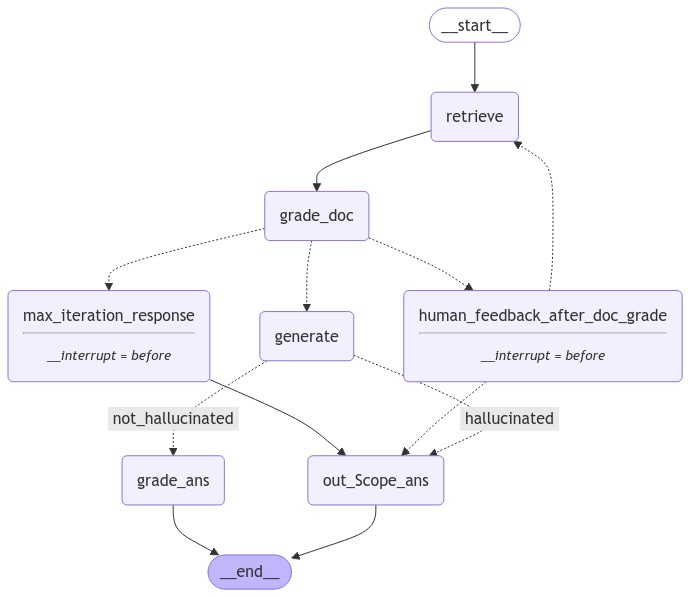
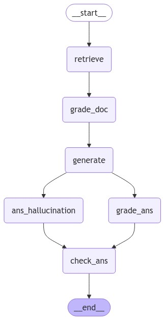

# Conditional + Parallel Graph Execution with LangGraph, LangChain and Ollama

After doing sequential graph execution in LangGraph, I wanted to explore the
conditional and parallel execution graph flow, so I came up with a contrived example,
where I have expanded a simple RAG use case.

## What does the repo cover

This repo has examples of RAG with Human-in-loop, where the execution stops to
take in the user input and than proceeds as per the user input. The repo has two
flows:

1. Conditional RAG + Human In Loop
2. Parallel RAG Flow

### Conditional RAG + Human In Loop

- In this flow we have expanded the RAG flow to account for user input.
- The flow has following steps:
  1. Flow starts with the user question.
  2. Than the flow goes to Retrieval step, where we try to retrieve relevant documents as per user question.
  3. Next we Grade the retrieved docs for relevance.
  4. If no doc is relevant, we break to take Human Input, asking the user if they want to stop execution or re retrieve the docs one more time.
  5. If the User says No, we stop the execution.
  6. If they say Yes, we go to the Retrieval step again. But we also increment the retry counter so that we don't keep re trying.
  7. So if the next retry also does not get right docs we just skip the Human Loop and end the flow.
  8. If the relevant documents were found, we skip the Human Intervention and go to the Generate answer phase.
  9. After the Generate step we run it through a conditional edge that checks the answer for Hallucination, and based on the result we either go to End or Answer Grader phase.
  10. The Answer Grader phase just validates the answer to see if it answers the user question.
  11. If the answer is valid it returns it else it returns a Sorry response.
- Here is the flow diagram auto generated via LangGraph and Mermaid
  

- Here is general Graph flow in short, details can be found in [workflow.py]('./agent/worflow.py)

  ```py
       # All the Nodes we need
       workflow = StateGraph(GraphState)
       workflow.add_node(RETRIEVE, retrieve)
       workflow.add_node(GENERATE, generate)
       workflow.add_node(GRADE_DOC, grade_documents)
       workflow.add_node(GRADE_ANS, grade_generation)
       workflow.add_node(OUT_SCOPE_ANS, default_ans)
       workflow.add_node(HUMAN_FEEDBACK_AFTER_DOC_GRADE, human_feedback_after_doc_grade)
       workflow.add_node(MAX_ITERATION_RESPONSE, max_iteration_response)

        # Entry point of graph
        workflow.set_entry_point(RETRIEVE)

        # All the edges we need b/w nodes
        workflow.add_edge(RETRIEVE, GRADE_DOC)
        workflow.add_edge(MAX_ITERATION_RESPONSE, OUT_SCOPE_ANS)
        workflow.add_edge(GRADE_ANS, END)
        workflow.add_edge(OUT_SCOPE_ANS, END)

        # All the conditional edges we need b/w nodes
        workflow.add_conditional_edges(
            GRADE_DOC,
            should_ask_for_human_input,
            {
                HUMAN_FEEDBACK_AFTER_DOC_GRADE: HUMAN_FEEDBACK_AFTER_DOC_GRADE,
                GENERATE: GENERATE,
                MAX_ITERATION_RESPONSE: MAX_ITERATION_RESPONSE
            },
        )

        # all nodes where the graph can divert to
        intermediates = [OUT_SCOPE_ANS, RETRIEVE]
        workflow.add_conditional_edges(
            HUMAN_FEEDBACK_AFTER_DOC_GRADE,
            route_to_retrieveagain_or_end,
        intermediates
        )
        # This is either or flow
        workflow.add_conditional_edges(
            GENERATE,
            grade_generation_for_hallucination,
            {
                'not_hallucinated': GRADE_ANS,
                'hallucinated': OUT_SCOPE_ANS
            }
        )

        memory = MemorySaver()
        # we tell the graph to stop at this step
        graph_sequence = workflow.compile(checkpointer=memory, interrupt_before=[HUMAN_FEEDBACK_AFTER_DOC_GRADE, MAX_ITERATION_RESPONSE])
        graph_sequence.get_graph().draw_mermaid_png(output_file_path='./graph-human-in-loop.png')
  ```

### Parallel RAG Flow

- In this flow we have simplified a bit and removed the Human factor for simplicity.
- The flow runs the Answer Grader and Hallucination check in parallel.
- The flow has following steps:
  1. Flow starts with the user question.
  2. Than the flow goes to Retrieval step, where we try to retrieve relevant documents as per user question.
  3. Next we go to the Generate step.
  4. After this we run the Answer Grader and Hallucination check steps in parallel.
  5. They both end up going to the Check Ans step. The beauty is the Check Ans step does not execute until both the parallel branches execution is finished.
- Here is the flow diagram auto generated via LangGraph and Mermaid
  
- Here is general Graph flow in short, details can be found in [workflow_parallel.py]('./agent/worflow_parallel.py)

  ```py
       workflow = StateGraph(GraphState)

       # All nodes
       workflow.add_node(RETRIEVE, retrieve)
       workflow.add_node(GRADE_DOC, grade_documents)
       workflow.add_node(GENERATE, generate)
       workflow.add_node(GRADE_ANS, grade_generation)
       workflow.add_node(GRADE_ANS_HALLUCINATION, grade_ans_for_hallucination)
       workflow.add_node(CHECK_ANS, check_ans)

       # Entry point
       workflow.set_entry_point(RETRIEVE)
       # connection for the nodes
       workflow.add_edge(RETRIEVE, GRADE_DOC)
       workflow.add_edge(GRADE_DOC, GENERATE)
       workflow.add_edge(CHECK_ANS, END)

       # This is the Parallel flow, where we say a node fans out into 2 nodes
       workflow.add_edge(GENERATE, GRADE_ANS)
       workflow.add_edge(GENERATE, GRADE_ANS_HALLUCINATION)

       # this is the 2 nodes fanning in into a single node
       workflow.add_edge(GRADE_ANS, CHECK_ANS)
       workflow.add_edge(GRADE_ANS_HALLUCINATION, CHECK_ANS)

       memory = MemorySaver()
       # we tell the graph to stop at this step
       graph_parallel = workflow.compile(checkpointer=memory)
       graph_parallel.get_graph().draw_mermaid_png(output_file_path='./graph-parallel.png')
  ```

### Local Development

- The repo has following folders:
  - agent - This folder is a sub package and contains the code for:
    1. Chains - All the LLM chains are defined in this file.
    2. Graph - The Graph state is defined here.
    3. nodes - All the graph nodes are defined in this file.
    4. workflow - This has the workflow for the Conditional RAg with Human in loop.
    5. workflow_parallel - This has the workflow defined for parallel execution.
  - doc_ingestion - This package contains the code for parsing the PDF and converting it into embeddings and creating a vector retrieval from it.
  - prompts - This package has all the prompts needed to build the chain.
- The root level `main.py` file is the entry point. This file imports the needed workflow and executes it.
- For installing the dependencies there is a `requirement.txt` file, we can just run the following command `pip install -r requirements.txt`.
